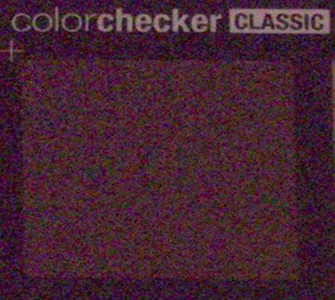
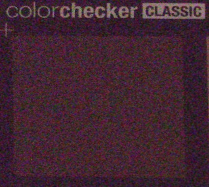
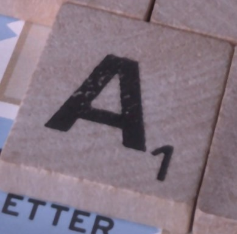
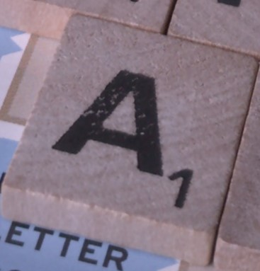
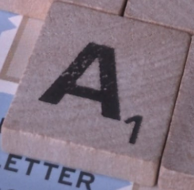
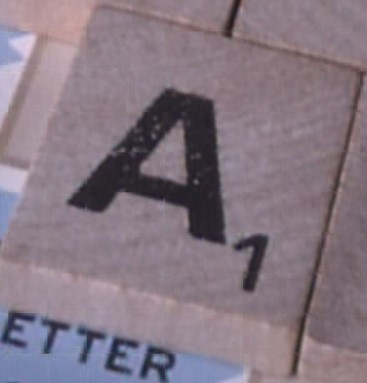
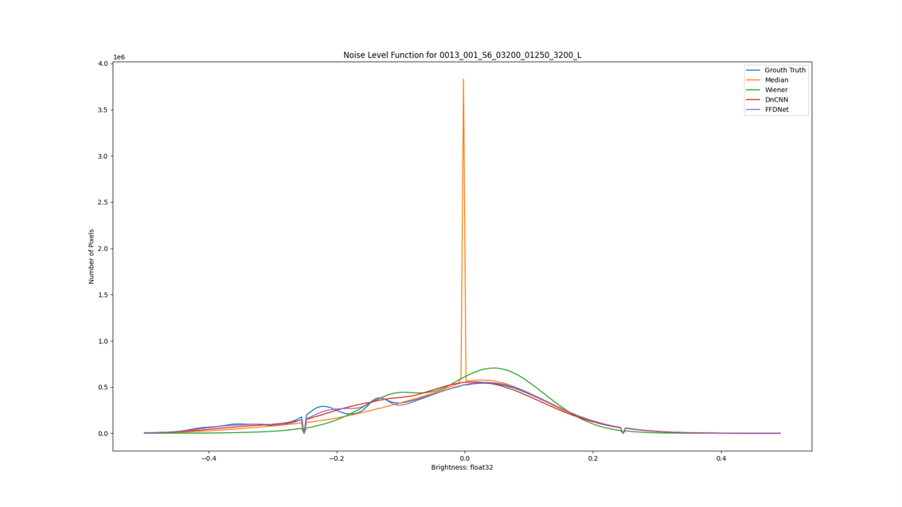
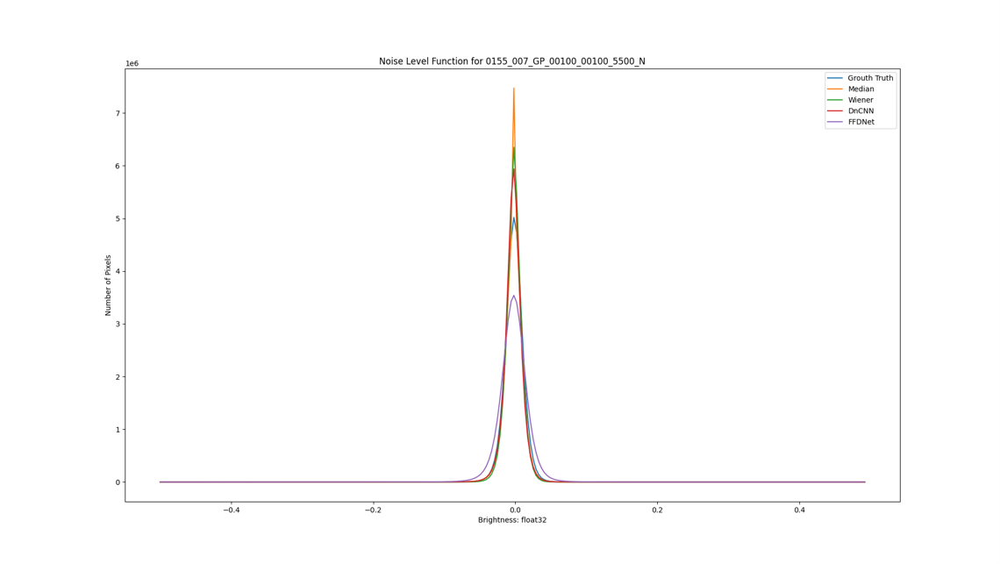

# Denoising

 

## Contents

This repository contains:
* Median filtering using a 5 x 5 window
* Wiener filtering using a 5 x 5 window
* DnCNN for RGB images using 17 intermediate layers
* FFDNet for RGB images using 12 intermediate layers
* A script to calculate PSNR, SSIM, and plot Noise Level Functions

## Dataset
The data set used in this experiment was the [SIDD-Small Dataset](https://www.eecs.yorku.ca/~kamel/sidd/) sRGB images only.

## System Configuration
|  CPU | GPU | RAM |
| :---: | :---: | :---: |
|  Threadripper 3970x | RTX 3090 | 32 GB |

## Required VRAM for GPU Training
|  Network | VRAM |
| :---: | :---: |
|  DnCNN | 6 GB |
|  FFDNet | 3 GB |

# Results
## Sample Images
**Noisiest Image**

**Cleanest Image**

## Training and Computation Time
**Computation time for tested methods. All values are in seconds. Lower is better.**

|  Metric | **Median Filtering** | **Wiener Filtering** | **DnCNN** | **FFDNet** |
| :---: | :---: | :---: | :---: | :---: |
|  **Training Time** | **0** | **0** | 14103.95 | 19902.12 |
|  **Evaluation Time** | 4612.02 | 2756.66 | **1140.10** | 1498.53 |
|  **Average Time (Training Included)** | 28.82 | **17.23** | 95.27 | 133.75 |
|  **Average Time (Training Excluded)** | 28.82 | 17.23 | **7.13** | 9.37 |

## PSNR
**Peak-signal-to-noise-ratio for tested methods. All values are in dB. Higher is better.**

|  Metric | **Median Filtering** | **Wiener Filtering** | **DnCNN** | **FFDNet** |
| :---: | :---: | :---: | :---: | :---: |
|  **Average PSNR** | 33.19 | 32.69 | **35.33** | 34.71 |
|  **PSNR Noisiest Image** | 21.57 | 21.60 | 26.79 | **29.85** |
|  **PSNR Cleanest Image** | 41.33 | **41.63** | 40.14 | 36.19 |
|  **PSNR Random Image** | 31.81 | 31.97 | **35.29** | 34.77 |

## SSIM
**Structural Similarity Index for tested methods. All values are a ratio between 0 and 1. Higher is better.**

|  Metric | **Median Filtering** | **Wiener Filtering** | **DnCNN** | **FFDNet** |
| :---: | :---: | :---: | :---: | :---: |
|  **Average SSIM** | 0.8952 | 0.8919 | 0.9328 | **0.9442** |
|  **SSIM Noisiest Image** | 0.5493 | 0.5710 | 0.7285 | **0.8848** |
|  **SSIM Cleanest Image** | 0.9893 | **0.9902** | 0.9847 | 0.9643 |
|  **SSIM Random Image** | 0.8937 | 0.9026 | **0.9516** | 0.9483 |

## NLF
**Noisiest Image**

**Cleanest Image**

## References
[1] Tian, C., Fei, L., Zheng, W., Xu, Y., Zuo, W., & Lin, C.-W. (2020, August 6). Deep learning on image denoising: An overview. Neural Networks. Retrieved October 16, 2021, from https://www.sciencedirect.com/science/article/abs/pii/S0893608020302665. 

[2] Abdelhamed, A., Lin, S., & Brown, M. S. (2018, June 1). A high-quality denoising dataset for Smartphone cameras. CVF Open Access. Retrieved October 16, 2021, from https://openaccess.thecvf.com/content_cvpr_2018/html/Abdelhamed_A_High-Quality_Denoising_CVPR_2018_paper.html. 

[3] Zhang, K., Zuo, W., Chen, Y., Meng, D., & Zhang, L. (n.d.). Beyond a gaussian denoiser: Residual learning of deep CNN for image denoising. IEEE Xplore. Retrieved October 30, 2021, from https://ieeexplore.ieee.org/document/7839189.

[4] Zhang, K., Zuo, W., & Zhang, L. (n.d.). FFDNet: Toward a Fast and Flexible Solution for CNN based Image Denoising. ArXiV. Retrieved October 30, 2021, from https://arxiv.org/pdf/1710.04026. 

[5] Immerkær, J. (2002, April 22). Fast noise variance estimation. Computer Vision and Image Understanding. Retrieved October 30, 2021, from https://www.sciencedirect.com/science/article/abs/pii/S1077314296900600. 

[6] Fan, L., Zhang, F., Fan, H., & Zhang, C. (2019, July 8). Brief review of image denoising techniques. Visual Computing for Industry, Biomedicine, and Art. Retrieved October 30, 2021, from https://vciba.springeropen.com/articles/10.1186/s42492-019-0016-7. 

[7] Team, T. A. I. (2021, January 23). Image de-noising using Deep Learning. Towards AI - The World's Leading AI and Technology Publication. Retrieved October 30, 2021, from https://towardsai.net/p/deep-learning/image-de-noising-using-deep-learning. 

[8] Veldhuizen, T. (1998, January 16). The Wiener Filter. University of Edinburgh Computer Vision. Retrieved November 30, 2021, from https://homepages.inf.ed.ac.uk/rbf/CVonline/LOCAL_COPIES/VELDHUIZEN/node15.html. 
